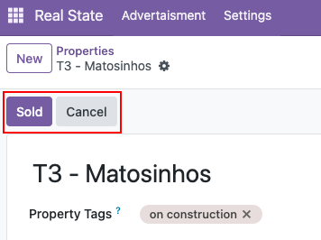
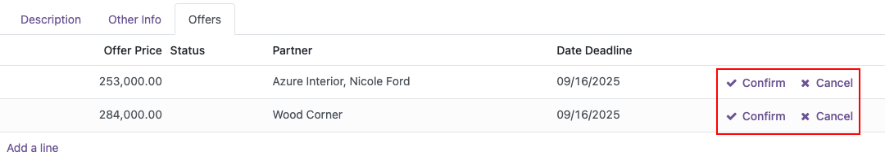
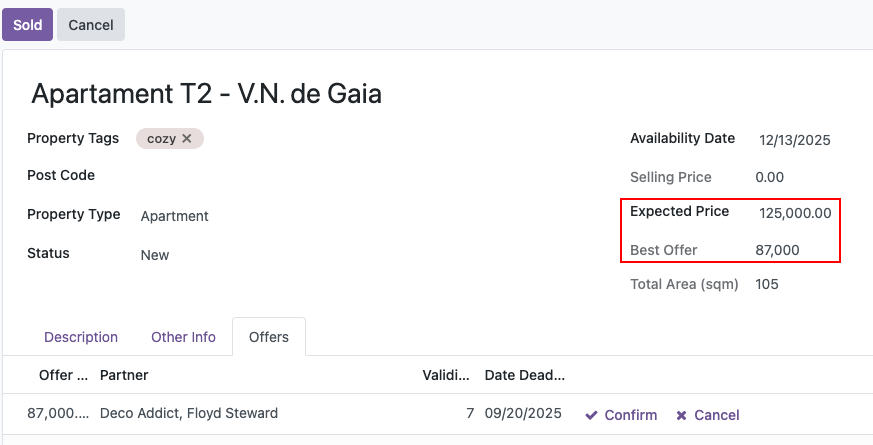
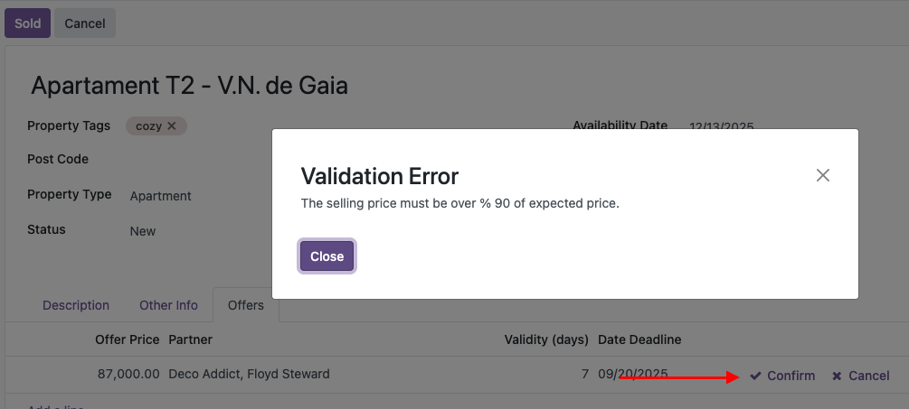
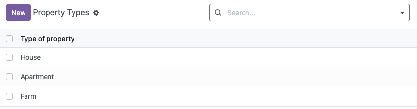
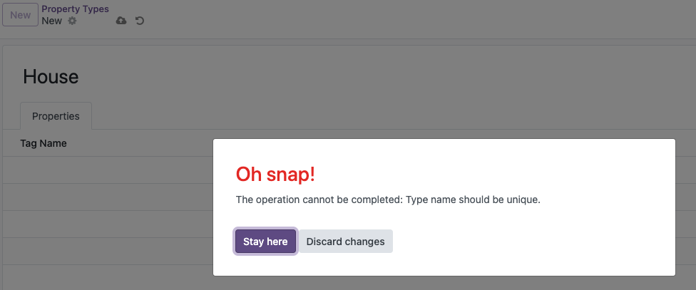

#  

## Chapter 9 - Some Actions

1. I added the buttons **Sold** and **Cancel** to confirm or reject a property.
    * Conditioning the use once the stage is between both.  
    

2. Also I worked on **accept** or **refuse** an offer directly from the property form.  
    

## Chapter 10 - Constrains 

1. Was raised a condition whitch is not posible sold a property if the offer don't reach % 90 of the expected price.  
      
    

2. The property types mus be unique.  
      
    

## Chapter 11 - Constrains 